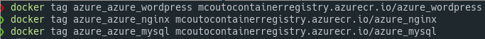

# Práctica Azure

## Pasos azure

- Log in

```
az login
```


- Listar locations

```
 az appservice list-locations --sku S1 --linux-workers-enabled.

```


- Crear el grupo de recursos

```
az group create --name mCoutoResourcesGroup --location "West Europe"
```


- Crear plan de servicio

```
az appservice plan create --name mCoutoServicePlan --resource-group mCoutoResourcesGroup --sku S1 --is-linux

```


- Creación de aplicaión de Docker Compose

```
az webapp create --resource-group mCoutoResourcesGroup --plan mCoutoServicePlan --name mCoutoApp --multicontainer-config-type compose --multicontainer-config-file docker-compose-deploy.yaml
```


- Habilitar el servicio de persistencia

```
az webapp config appsettings set --resource-group mCoutoResourcesGroup --name mCoutoApp --settings WEBSITES_ENABLE_APP_SERVICE_STORAGE=true
```


-

- Actualizar configuración compose

```
az webapp config container set --resource-group mCoutoResourcesGroup --name mCoutoApp --multicontainer-config-type compose --multicontainer-config-file docker-compose-deploy.yaml
```


- Habilitar el registro de diagnóstico

```
az webapp log config --name <app-name> --resource-group <resource-group-name> --docker-container-logging filesystem

```

- Crear resources Group

```
az acr create --resource-group mCoutoResourcesGroup --name mCoutoContainerRegistry --sku Basic
```


## Login in to container registry

- Primero hay que crear un resource group

- Create Azure container registry

```
az acr create --resource-group mCoutoResourcesGroup --name mCoutoContainerRegistry --sku Basic
```

- Logearse en el registry

```
az acr login --name <acrName>
```

- Construir la imagen

```
docker-compose up --build -d
```

- Activar acceso admin

```
az acr update -n mCoutoContainerRegistry --admin-enabled true
```

- Deploy de la imagen a Azure

```
docker-compose push
```




